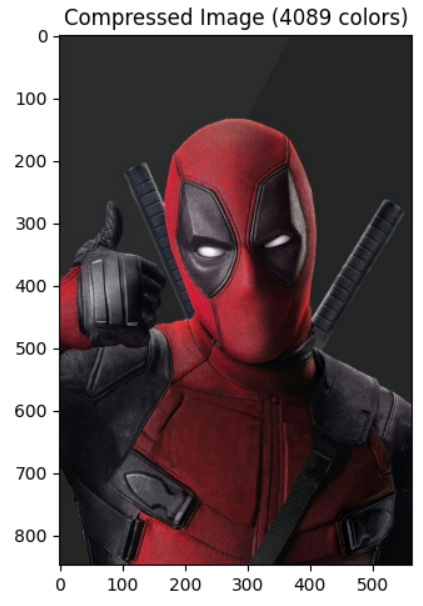

# 🎨 K-Means Image Compression

This project demonstrates how to compress an image by reducing its color complexity using **K-Means clustering**. It clusters similar colors and reconstructs the image using the cluster centers, significantly reducing the number of unique colors while preserving visual quality.

---

## 📸 Example

> Original image vs. compressed image (with ~9% of the original unique colors):

| Original | Compressed |
|----------|------------|
|  |  |

> *(Replace `c1.png` and `c2.png` with actual screenshot file names if different.)*

---

## 🚀 Features

- Automatically determines number of colors (≈ 9% of unique colors).
- Displays side-by-side comparison of original and compressed image.
- Simple and efficient implementation with minimal dependencies.

---

## 🧠 How It Works

1. Loads an input image (`deadpool.jpg` by default).
2. Converts it from BGR (OpenCV format) to RGB.
3. Reshapes image to a flat array of RGB pixels.
4. Applies **K-Means clustering** to reduce color space.
5. Reconstructs and displays the compressed image.

---

## 🛠️ Installation & Usage

### 🔧 Requirements

- Python 3.x
- OpenCV
- NumPy
- scikit-learn
- Matplotlib

Install dependencies:

```bash
pip install numpy opencv-python scikit-learn matplotlib
